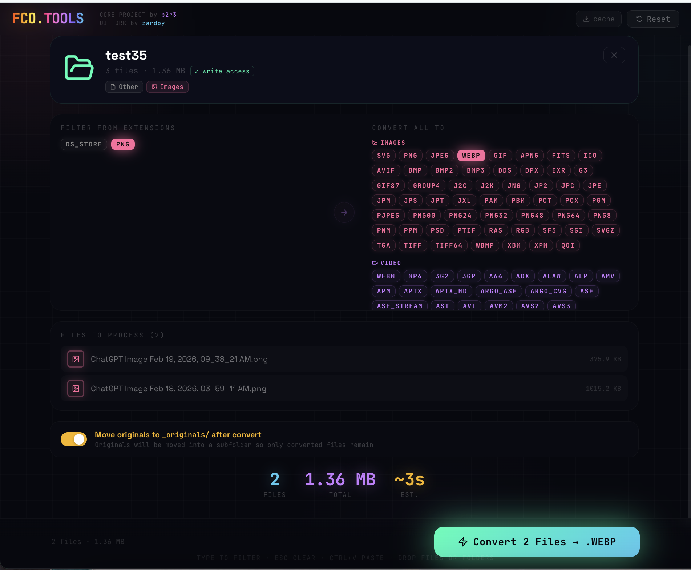

# Convert it! — Test fork

> Rolling experimental improvements, opinionated features & workflows.

---

## Features

- **Beautiful UI** — Dark theme, clear hierarchy, reskins planned.
- **Open as folder & convert many files** — Use **In Folder Convert** and the File System Access API: pick a folder, choose formats, convert. Files are written **directly into that folder** — no download step. Optional: move originals into `_originals/` after conversion.
- **Drag & drop** — Drop files or folders onto the page. **Ctrl+V** (or Cmd+V) to paste from clipboard.
- **Quick shortcuts** — **Press `1`** with a single file loaded to convert to the first suggested format instantly. Type to filter formats, **Esc** to clear. Suggested formats are sorted by category and your **recently used** choices.
- **Single-file workflow** — **Drag out** the converted file from the browser into any folder (no download clutter). Or use **Share** (Web Share API) or **Download**. Optional auto-download for single-file conversions.
- **Batch options** — Convert multiple files without folder write access? **Download N files** or **Download as ZIP** (one archive).
- **PWA** — Install as an app from the browser for a native-like launcher (no offline support in this fork).

---

## Was this vibecoded?

**Yes.** (The scroll/filter perf probably gives it away.)

One goal was to push the limits of prompting: you still need solid knowledge of web APIs, browser gotchas, and power-user shortcuts to get a decent frontend. Without that, this UI wouldn’t exist.

---

## Is that all?

**Mostly**. A few ideas didn’t pan out (yet):

**Copy to clipboard**
Nice in theory, but many file MIME types can’t be written to the async Clipboard API without errors, so clipboard paste isn’t reliable for arbitrary converted files. We use **drag-out** instead.

**Chrome extension**
Still under consideration. A quick UI triggered from the extension could be handy, but you can already “install” the site as an app. Replacing file inputs on random sites with a custom converter UI doesn’t seem like a reliable workflow yet — need to understand real use cases better.

**Electron app**
Under strong consideration. Using real FFmpeg in a desktop gives much better performance and also native explorer integration would be a big thing. Might happen in a few days if i dont forget of this repo.

**Mobile native app**
Out of scope for now; could be revisited later.

---

## Credits

**ORIGINAL MAINTAINER:** [p2r3/convert](https://github.com/p2r3/convert) — the universal in-browser converter.
